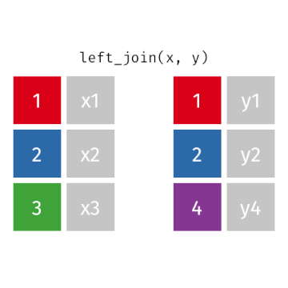

```{r setup, include = FALSE}
knitr::opts_chunk$set(echo = TRUE, 
                      warning = FALSE, 
                      message = FALSE)
library(dplyr)
```

```{css custom, echo=FALSE}
.title{
    display: none;
}
blockquote {
  display: block;
  font-size: 0.95em;
  border-left: 3px solid #7FB036;
  padding:10px;
  margin-left:10px;
}
```

<div>
<br>
 
 <span style = "font-weight:bold;font-size:40px;"> 
  &nbsp;<code>dplyr::left_join()</code>
 </span>
 <br>
 <b>&nbsp;&nbsp;&nbsp;<code>{introverse}</code> quick docs</b>
</div>
<br>

### Description

The [`left_join()`](https://dplyr.tidyverse.org/reference/left_join.html) function is part of the [`{dplyr}`](https://dplyr.tidyverse.org/) package, which is part of the [`{tidyverse}`](https://www.tidyverse.org/).

We use this function to merge _two relational datasets_. Specifically, `left_join()` retains all rows from the left tibble (data frame) and incorporates columns from the right tibble (data frame): It merges the _right into the left._ Missing row information becomes `NA` in the final output, represented in the GIF below by the blank cell.

```{r tidyexplain, echo=F, out.width = "50%"}

```


<!-- Add the following if the topic is a function that does NOT come with base R, and uncomment/fill in the subsequent multiline HTML comment: -->
To use this function, you need to either first load the `{dplyr}` library, or always use the function with `dplyr::left_join()` notation.

```{r description, eval=FALSE}
# Load the library
library(dplyr)
# Or, load the full tidyverse:
library(tidyverse)

# Or, use :: notation
dplyr::left_join()
```


## Conceptual usage 

```{r usage, eval=FALSE}
left_join(left tibble, right tibble)

# or with piping:
left tibble %>%
  left_join(right tibble)
```

### Examples

Consider the following example datasets, These two tibbles have column names `name` and `vore` in common. They both contain rows for "Dog", "Pig", and "Rabbit", but `first_tibble` also contains "Tiger" and `second_tibble` also contains "Sheep".

```{r show_example_data, collapse=TRUE}
first_tibble

second_tibble
```

<br>


```{r example1}
# left_join to merge second_tibble into first_tibble
first_tibble %>%
  left_join(second_tibble)
```

<br>

```{r example2}
# left_join to merge first_tibble into second_tibble
second_tibble %>%
  left_join(first_tibble)
```
